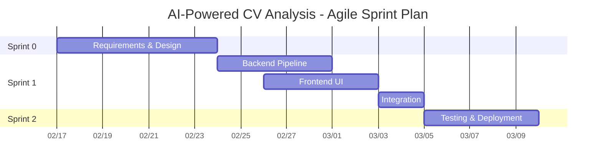

# AI-Powered CV Analysis — Agile Sprint Plan

> **Project**: AI-Powered CV Analysis (CVPrime / JobFit AI)
> **Methodology**: Agile (Scrum)
> **Sprint Duration**: ~1 week
> **Project Timeline**: Feb 17 – Mar 9, 2026 (3 weeks)

---

## Why Agile

The Waterfall plan (see `waterfall-project-plan.md`) defines a clear sequential baseline. Agile adds:

1. **Short feedback loops** — prompt engineering and RAG tuning benefit from fast iteration.
2. **Incremental delivery** — each sprint produces a demo-able increment (upload → analyse → results).
3. **Flexibility** — re-prioritise based on what works (e.g. embedding model, agent tools).

---

## Sprint Overview

| Sprint | Duration | Theme | Status |
|--------|----------|-------|--------|
| **Sprint 0** | Feb 17 – Feb 23 | Requirements, Design | 🔲 Planned |
| **Sprint 1** | Feb 24 – Mar 4 | Backend + Frontend + Integration | 🔲 Planned |
| **Sprint 2** | Mar 5 – Mar 9 | Testing, Deployment, Acceptance | 🔲 Planned |

---

## Sprint 0 — Requirements & Design

> Feb 17 – Feb 23 · Aligns with Waterfall Phase 1 & 2

### Sprint Backlog

| ID | Task | Owner |
|----|------|-------|
| R1 | Requirements: user flow (upload → analyse → results), MVP scope (parsing, RAG, ATS score, recommendations, agent Q&A) | Dev |
| R2 | Non-functional: analysis < 60s, Docker deployment | Dev |
| D1 | System design: Backend/Frontend split, pipeline (load → chunk → extract → match → recommend) | Dev |
| D2 | Tech stack: FastAPI, Next.js, LangChain, FAISS, HuggingFace embeddings, Claude Sonnet | Dev |
| D3 | Deliverable: `Docs/02-system-architecture.md` | Dev |

### Expected Outcome

> Requirements and architecture document clarified. Pipeline and tech decisions locked.

---

## Sprint 1 — Backend + Frontend + Integration

> Feb 24 – Mar 4 · Aligns with Waterfall Phase 3

### Sprint Backlog

| ID | Task | Owner |
|----|------|-------|
| B1 | Document loader (Factory): PDF, DOCX, TXT | Dev |
| B2 | Text chunker (LangChain RecursiveCharacterTextSplitter) | Dev |
| B3 | CV extractor (ChatAnthropic + with_structured_output) | Dev |
| B4 | Job matcher (FAISS + HuggingFaceEmbeddings) | Dev |
| B5 | Recommender (LCEL chain: prompt \| llm \| parser) | Dev |
| B6 | Agent (LangGraph create_react_agent + 4 tools) | Dev |
| B7 | FastAPI endpoints: /upload, /analyze/{id}, /agent/query | Dev |
| F1 | Frontend: FileUpload (react-dropzone), page layout | Dev |
| F2 | Frontend: LoadingSpinner, AnalysisResults dashboard | Dev |
| F3 | Frontend: API client (lib/api.ts), types | Dev |
| I1 | Integration: CORS, NEXT_PUBLIC_API_URL, E2E wiring | Dev |

### Key Dependencies

- B1 → B2 → B3 → B4 → B5 (pipeline order)
- B6 can run in parallel after B3
- F1, F2, F3 can run in parallel; I1 after B7 + F3

### Expected Outcome

> **Working MVP.** User can upload CV → see analysis (skills, matches, recommendations) → ask agent Q&A. Backend and Frontend run locally or via Docker.

---

## Sprint 2 — Testing, Deployment & Acceptance

> Mar 5 – Mar 9 · Aligns with Waterfall Phase 4 & 5

### Sprint Backlog

| ID | Task | Owner |
|----|------|-------|
| T1 | Unit tests: document loader, text chunker | Dev |
| T2 | Integration tests: upload, analyse endpoints | Dev |
| T3 | E2E: upload → analyse → display flow | Dev |
| T4 | Docker `docker compose up` smoke test | Dev |
| D1 | Production Docker builds, README, .env.example | Dev |
| D2 | Acceptance: upload works, analysis returns results, agent responds | Dev |

### Expected Outcome

> **Delivery-ready.** All tests pass, Docker runs cleanly, MVP acceptance criteria met.

---

## Scrum Practices

| Practice | How We Do It |
|----------|-------------|
| **Sprint Planning** | Start of sprint, ~30 min — select tasks, confirm dependencies |
| **Daily Standup** | 10 min — progress, blockers, plan |
| **Sprint Review** | End of sprint — demo working software |
| **Retrospective** | End of sprint, 15 min — what went well, improvements |
| **Definition of Done** | Tests pass, lint clean, PR merged to `develop` / `main` |
| **Task Board** | GitHub Projects or similar (Backlog → To Do → In Progress → Done) |

---

## Agile vs Waterfall Comparison

| Aspect | Waterfall | Agile |
|--------|-----------|-------|
| Delivery | Single release at end | Working increment each sprint |
| Feedback | Late (testing phase) | Every sprint review |
| Change | Formal change request | Re-prioritise backlog each sprint |
| Testing | Separate phase | Continuous (unit + integration) |
| Risk | Late integration issues | Early integration in Sprint 1 |
| Best for | Predictable scope | AI/LLM prompt tuning, iterative refinement |
