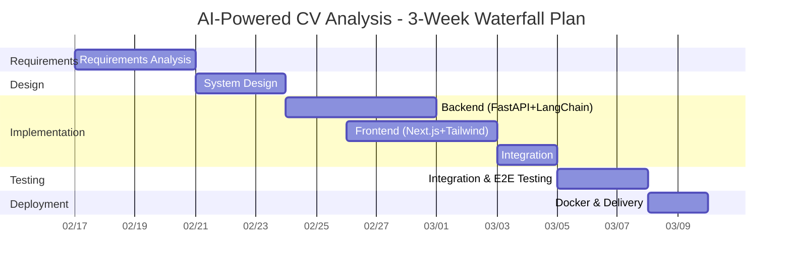

# AI-Powered CV Analysis — Waterfall Project Plan

> **Project**: AI-Powered CV Analysis (CVPrime / JobFit AI)
> **Methodology**: Waterfall
> **Estimated Duration**: 3 weeks

---

## Waterfall Gantt Chart

---

## Phase Details

### Phase 1 — Requirements Analysis (4 days)

| Item | Scope |
|------|--------|
| **Duration** | Week 1, Days 1–4 |
| **Deliverable** | Requirements document or backlog |
| **Scope** | User flow (upload → analyse → results), MVP features: resume parsing (PDF/DOCX/TXT), RAG-based job matching, ATS score, recommendations, agent Q&A. Non-functional: < 60s analysis, Docker deployment. |

### Phase 2 — System Design (3 days)

| Item | Scope |
|------|--------|
| **Duration** | Week 1, Days 5–7 |
| **Deliverables** | `Docs/02-system-architecture.md` |
| **Scope** | Backend/Frontend split, pipeline design (load → chunk → extract → match → recommend), tech stack (FastAPI, Next.js, LangChain, FAISS, Claude). Design patterns: Singleton config, Factory loader. |

### Phase 3 — Implementation (12 days)

| Item | Scope |
|------|--------|
| **Duration** | Week 2 + start of Week 3 |
| **Tracks** | **Backend**: Document loader (Factory), text chunker, CV extractor (structured output), job matcher (FAISS), recommender (LCEL), agent (LangGraph). **Frontend**: Upload UI, results dashboard, agent chat. |
| **Key Milestones** | Backend API + unit tests → Frontend components → Full stack wiring |

### Phase 4 — Integration & Testing (3 days)

| Item | Scope |
|------|--------|
| **Duration** | Week 3, Days 13–15 |
| **Scope** | E2E flow (upload → analyse → display), API contract validation, Docker `docker compose up` smoke test. |

### Phase 5 — Deployment & Acceptance (2 days)

| Item | Scope |
|------|--------|
| **Duration** | Week 3, Days 16–17 |
| **Scope** | Production Docker builds, README and `.env.example` setup, acceptance: upload works, analysis returns results, agent Q&A responds. |

---

## Timeline Summary

| Phase | Start | End | Days |
|-------|-------|-----|------|
| Requirements | Feb 17 | Feb 20 | 4 |
| Design | Feb 21 | Feb 23 | 3 |
| Implementation | Feb 24 | Mar 4 | 10 |
| Testing | Mar 5 | Mar 7 | 3 |
| Deployment | Mar 8 | Mar 9 | 2 |
| **Total** | | | **~22 days (~3 weeks)** |
